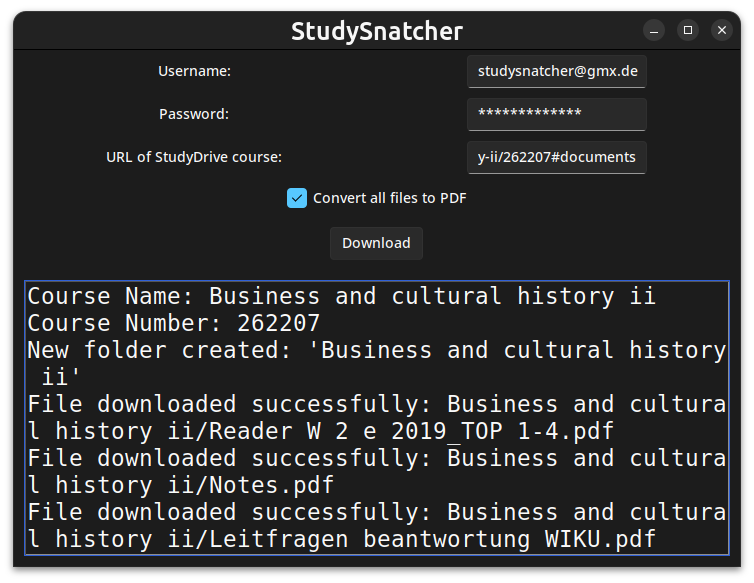

<!-- Improved compatibility of back to top link: See: https://github.com/othneildrew/Best-README-Template/pull/73 -->
<a id="readme-top"></a>
<!--
*** Thanks for checking out the Best-README-Template. If you have a suggestion
*** that would make this better, please fork the repo and create a pull request
*** or simply open an issue with the tag "enhancement".
*** Don't forget to give the project a star!
*** Thanks again! Now go create something AMAZING! :D
-->


<!-- PROJECT SHIELDS -->
<!--
*** I'm using markdown "reference style" links for readability.
*** Reference links are enclosed in brackets [ ] instead of parentheses ( ).
*** See the bottom of this document for the declaration of the reference variables
*** for contributors-url, forks-url, etc. This is an optional, concise syntax you may use.
*** https://www.markdownguide.org/basic-syntax/#reference-style-links
-->


<!-- PROJECT LOGO -->
<br />
<div align="center">
  


<h3 align="center">StudySnatcher</h3>

  <p align="center">
    Download all files from any StudyDrive courses
  </p>
</div>


<!-- TABLE OF CONTENTS -->
<details>
  <summary>Table of Contents</summary>
  <ol>
    <li>
      <a href="#about-the-project">About The Project</a>
      <ul>
        <li><a href="#built-with">Built With</a></li>
      </ul>
    </li>
    <li><a href="#features">Features</a></li>
    <li><a href="#installation">Installation</a></li>
    <li><a href="#usage">Usage</a></li>
    <li>
      <a href="#usage">Usage</a>
      <ul>
        <li><a href="#1-run-the-gui">Run the GUI</a></li>
        <li><a href="#2-use-the-backend">Use the Backend</a></li>
      </ul>
    </li>
    <li><a href="#how-it-works">How it works</a></li>
    <li><a href="#roadmap">Roadmap</a></li>
    <li><a href="#contributing">Contributing</a></li>
    <li><a href="#acknowledgments">Acknowledgments</a></li>
  </ol>
</details>


<!-- ABOUT THE PROJECT -->
## About The Project

<div align="center">

</div>

This project provides a tool to automate downloading documents from StudyDrive. It is divided into two main components: a backend connecting to the StudyDrive-API and a graphical user interface (GUI). The backend handles authentication, fetching course documents, and downloading files, while the GUI allows users to interact with the tool in an intuitive way.

<div align="center">
  <a href="https://github.com/StudySnatcher/StudySnatcher/releases/latest">
  
  <a>
</div>

<div align="right">(<a href="#readme-top">back to top</a>)</div>


### Built With


<div align="right">(<a href="#readme-top">back to top</a>)</div>

## Features

1. **Backend API**:
   - Authenticate users on StudyDrive.
   - Fetch course document metadata.
   - Download course documents to a local directory.
   - Handle rate-limiting and retry logic for smooth operation.

2. **GUI**:
   - Simple, user-friendly interface built using `Tkinter`.
   - Allows users to input credentials, course URL, and other preferences.
   - Displays real-time logs and status updates.

3. **Reusability**:
   - The backend API can be used independently in other Python projects to interact with StudyDrive programmatically.

<div align="right">(<a href="#readme-top">back to top</a>)</div>

## Installation

### Prerequisites
- Python 3.8 or later
- Required Python packages (install via `pip`):
  ```bash
  pip install -r requirements.txt
  ```
<!-- pip install requests sv_ttk darkdetect notify_py pillow -->

### Build executable with `pyinstaller`
- Install `pyinstaller` (via `pip`)
  ```bash
  pip install pyinstaller
  ```
- Build executable
  ```bash
  pyinstaller "StudyDrive Scraper.spec"
  ```
- The executable is in the `dist` folder

<div align="right">(<a href="#readme-top">back to top</a>)</div>

## Usage

### 1. Run the GUI
The GUI is designed for non-technical users who want to interact with the tool visually.

1. Launch the GUI:
   ```bash
   python studydrive_scraper.py
   ```
2. Enter:
   - **Username** and **Password**: Your StudyDrive login credentials.
   - **Course URL**: The URL of the StudyDrive course from which you want to download documents.
   - **Convert to PDF**: Check this option if you want files to be converted to PDF format (if supported).
3. Click **Download**. The application will:
   - Authenticate your credentials.
   - Fetch the list of documents available in the course.
   - Download the files into a folder named after the course.
4. Monitor progress and logs in the on-screen message area.

### 2. Use the Backend
The backend can be integrated into other Python scripts for programmatic use.

#### Example:
```python
from scraper_backend import run

username = "your-email@example.com"
password = "yourpassword"
course_url = "https://www.studydrive.net/de/course/sample-course/12345"
converted_to_pdf = False

run(username, password, course_url, converted_to_pdf)
```
<div align="right">(<a href="#readme-top">back to top</a>)</div>

## How It Works

1. **Authentication**:
   - The user logs in with their credentials.
   - A session is initialized, including client secret generation and authentication headers.

2. **Course Parsing**:
   - The course URL is parsed to extract the course name and ID.

3. **Document Retrieval**:
   - The backend fetches metadata about all documents in the course.

4. **File Download**:
   - Each document's download link is fetched.
   - The file is saved to a local folder named after the course.

5. **Rate-Limit Handling**:
   - If the API returns a 429 (rate-limit exceeded), the backend automatically retries after the specified wait time.

<div align="right">(<a href="#readme-top">back to top</a>)</div>


<!-- ROADMAP -->
## Roadmap

- [ ] Display a progress bar, based on the rate limit (30 requests before waiting 57 sec) and the number of pages (~50 documents per page)
- [ ] Add support for parallel downloads in a single session.
- [ ] Improve error handling and display user-friendly error messages in the GUI.
- [ ] Add a stop button for ongoing downloads

<div align="right">(<a href="#readme-top">back to top</a>)</div>


<!-- CONTRIBUTING -->
## Contributing

Contributions are what make the open source community such an amazing place to learn, inspire, and create. Any contributions you make are **greatly appreciated**.

If you have a suggestion that would make this better, please fork the repo and create a pull request. You can also simply open an issue with the tag "enhancement".
Don't forget to give the project a star! Thanks again!

1. Fork the Project
2. Create your Feature Branch (`git checkout -b feature/AmazingFeature`)
3. Commit your Changes (`git commit -m 'Add some AmazingFeature'`)
4. Push to the Branch (`git push origin feature/AmazingFeature`)
5. Open a Pull Request

<div align="right">(<a href="#readme-top">back to top</a>)</div>


<!-- ACKNOWLEDGMENTS -->
## Acknowledgments

* Based on [Romern/studydrive_download_new.py](https://gist.github.com/Romern/63d6f43de6a5668fcd86efd86b689d07)

<div align="right">(<a href="#readme-top">back to top</a>)</div>


